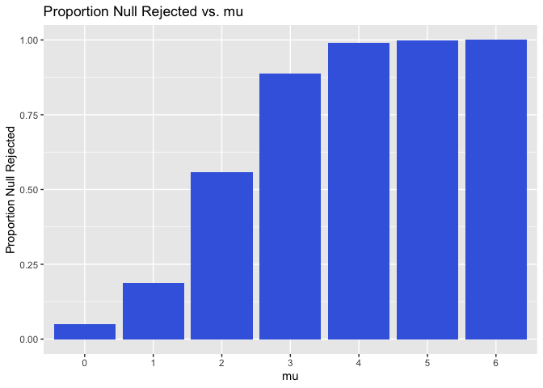

p8105_hw5_hmz2105
================
Haley Zylberberg

``` r
library (tidyverse)
```

    ## ── Attaching core tidyverse packages ──────────────────────── tidyverse 2.0.0 ──
    ## ✔ dplyr     1.1.3     ✔ readr     2.1.4
    ## ✔ forcats   1.0.0     ✔ stringr   1.5.0
    ## ✔ ggplot2   3.4.3     ✔ tibble    3.2.1
    ## ✔ lubridate 1.9.2     ✔ tidyr     1.3.0
    ## ✔ purrr     1.0.2     
    ## ── Conflicts ────────────────────────────────────────── tidyverse_conflicts() ──
    ## ✖ dplyr::filter() masks stats::filter()
    ## ✖ dplyr::lag()    masks stats::lag()
    ## ℹ Use the conflicted package (<http://conflicted.r-lib.org/>) to force all conflicts to become errors

``` r
set.seed(1234)
```

# Problem 1

This problem uses data that the Washington Post gathered on homicides in
50 large U.S. cities.

``` r
homicide_df = 
  read_csv("data_prob1/homicide-data.csv") |>
    janitor::clean_names() |>
    mutate(city_state = paste(city, state, sep = ", "))|>
  filter(city_state != "Tulsa, AL") 
```

    ## Rows: 52179 Columns: 12
    ## ── Column specification ────────────────────────────────────────────────────────
    ## Delimiter: ","
    ## chr (9): uid, victim_last, victim_first, victim_race, victim_age, victim_sex...
    ## dbl (3): reported_date, lat, lon
    ## 
    ## ℹ Use `spec()` to retrieve the full column specification for this data.
    ## ℹ Specify the column types or set `show_col_types = FALSE` to quiet this message.

The raw data includes year of homicide, homicide victim name, race, age
and sex, city, state and lat/long of the homicide, and the status of the
disposition. There are ’r nrow(homicide_df)\` entries. The variable from
Tulsa AL is likely an error as there is only one entry.

Next will summarize within cities to obtain the total number of
homicides and the number of unsolved homicides.

``` r
sum_homicide_df= homicide_df |>
 group_by(city_state, disposition) |>
  summarize(total_homicides = n()) |>
  group_by(city_state) |>
  mutate(
    unsolved_homicides = sum(total_homicides[disposition %in% c("Closed without arrest", "Open/No arrest")]),
    total_homicides = sum(total_homicides)
  ) %>%
  ungroup() |>
   select(city_state, total_homicides, unsolved_homicides) |>
   distinct(city_state, .keep_all = TRUE)
```

    ## `summarise()` has grouped output by 'city_state'. You can override using the
    ## `.groups` argument.

Next will estimate the proportion of homicides that are unsolved from
Baltimore, MD, along with confidence intervals. These values are shown
in the table below.

``` r
bmd_homicide_df = sum_homicide_df|>
  filter(city_state == "Baltimore, MD") |>
  summarise(
    prop_test_result = list(prop.test(unsolved_homicides, total_homicides) |> broom::tidy())
  ) |>
  unnest(prop_test_result) |>
  select(estimate, conf.low, conf.high) 

bmd_homicide_df|> 
  knitr::kable()
```

|  estimate |  conf.low | conf.high |
|----------:|----------:|----------:|
| 0.6455607 | 0.6275625 | 0.6631599 |

Next estimate the unsolved homicides in every city, using map function.

``` r
 estimate_homicide_df<- sum_homicide_df |>
  group_by(city_state) |>
  summarise(
    prop_test_result = list(purrr::map2(unsolved_homicides, total_homicides, ~broom::tidy(prop.test(.x, .y))))
  ) |>
 unnest(prop_test_result) |>
   unnest(prop_test_result) |>
  select(city_state, estimate, conf.low, conf.high)
```

Make a plot showing the estimate and confidence intervals of the
proportion of unsolved homicides per city.

``` r
estimate_homicide_df |>
  mutate(city_state = fct_reorder(city_state, estimate)) |> 
  ggplot(aes(x = city_state, y = estimate)) + 
  geom_point() + 
  geom_errorbar(aes(ymin = conf.low, ymax = conf.high)) + 
  theme(axis.text.x = element_text(angle = 65, hjust = 1))
```

<!-- -->

This plot shows that there is a wide range of unsolved homicides
throughout the US, with Chicago having the largest proportion of
unsolved homicides.

# Problem 2

Create a tidy dataframe of this dataset which includes participants
among a control group and an experiment group with 8 weeks of
measurement data taken.

``` r
file_names = list.files(path = "data", pattern = "*.csv", full.names = TRUE)

data_list = map(file_names, ~read.csv(.x))

experiment_df = data.frame(file_name = file_names, do.call(rbind.data.frame, data_list)) |>
  separate(file_name, into = c("arm", "subject_id"), sep = "_") |>
  pivot_longer(
    week_1:week_8,
    names_to = "week",
    names_prefix = "week_",
    values_to = "value"
  ) |>
 mutate(arm = gsub("data/", "", arm),
        subject_id= gsub(".csv", "", subject_id)) |>
  select (subject_id, arm, week, value)
```

``` r
experiment_df |>
ggplot(aes(x = week, y = value, color = arm)) +
  geom_point() + 
  geom_line(aes(group = interaction(subject_id, arm))) +
  labs(x = "Week", y = "Value", color = "Study Arm") +
  theme_minimal()
```

<!-- -->

In this spaghetti plot we see that the experimental group had an
increase in the value measured from week 1 through week 8 while the
control group showed a slight decrease in the value measured over this
time period.

# Problem 3

## Explore whether a false null hypothesis will be rejected.

To do this, will generate a dataset of 50000 values from the model
x∼Normal\[μ,σ\], with the following design elements: n=30, σ=5, μ=0.For
each dataset, save μ̂ and the p-value arising from a test of H:μ=0 using
α=0.05. Then repeat the above for μ={1,2,3,4,5,6}.

``` r
sim_mean_test = function(n = 30, mu, sigma = 5) {
  
  sim_data = tibble(
    x = rnorm(n, mean = mu, sd = sigma),
  )
  
  result = sim_data %>%
    summarize(
      mu_hat = mean(x),
      p_value = broom::tidy(t.test(x)) |> 
        pull(p.value) 
    )
  
  return(result)
}

mu_values <- c(0, 1, 2, 3, 4, 5, 6)


sim_results_df = expand_grid(
  mu = mu_values,
  dataset = 1:5000
) |>
mutate(
  estimate_df = pmap(list(n = 30, mu = mu, sigma = 5), sim_mean_test)
) |>
unnest(estimate_df)
```

- Make a plot showing the proportion of times the null was rejected on
  the y axis and the true value of μ on the x axis.

``` r
sim_results_df = sim_results_df |>
   mutate(reject_null = case_when(
    p_value < 0.05 ~ 1,
    TRUE ~ 0
  )) 

sim_results_df |>
  group_by(mu)|>
  summarize(proportion_null_rejected= sum(reject_null)/5000) |>
ggplot(aes(x = factor(mu), y = proportion_null_rejected)) +
  geom_bar(stat = "identity", fill = "royal blue") +
  labs(title = "Proportion Null Rejected vs. mu", x = "mu", y = "Proportion Null Rejected") 
```

<!-- -->

Describe the association between effect size and power:

- A larger effect size is generally associated with higher statistical
  power, making it more likely for a study to detect a true effect.
  However, with a large enough sample size, even small effect sizes can
  be detected with high power.

- Make a plot showing the average estimate of μ̂ on the y axis (for all
  simulations and those where the null was rejected) and the true value
  of μ on the x axis.

``` r
mu_plot_df= 
sim_results_df |>
  group_by(mu) |>
  summarize(average_mu_hat = mean(mu_hat),
            average_rejected_mu_hat = mean(mu_hat[p_value < 0.05])
  )


  ggplot(mu_plot_df, aes(x = mu)) +
  geom_line(aes(y = average_mu_hat, color = "All Simulations")) +
  geom_point(aes(y = average_mu_hat, color = "All Simulations")) +
  geom_line(aes(y = average_rejected_mu_hat, color = "Null Rejected")) +
  geom_point(aes(y = average_rejected_mu_hat, color = "Null Rejected")) +
  labs(title = "Average Estimate of mu_hat vs. True Value of mu",
       x = "True Value of mu",
       y = "Average Estimate of mu_hat") +
  scale_color_manual(
    values = c("All Simulations" = "blue", "Null Rejected" = "red"),
    labels = c("All Simulations", "Null Rejected")
  ) +
  theme_minimal()
```

<!-- -->

Is the sample average of μ̂ across tests for which the null is rejected
approximately equal to the true value of μ? Why or why not?

- The μ̂ across the tests where the null is rejected equals μ as the
  values get larger. This occurs because the farther the u is from 0,
  the more likely it is to reject the null hypothesis on both tails. For
  example, when μ̂= 1, the values between 1 and 0 will not be rejected
  because they are too close to u.
